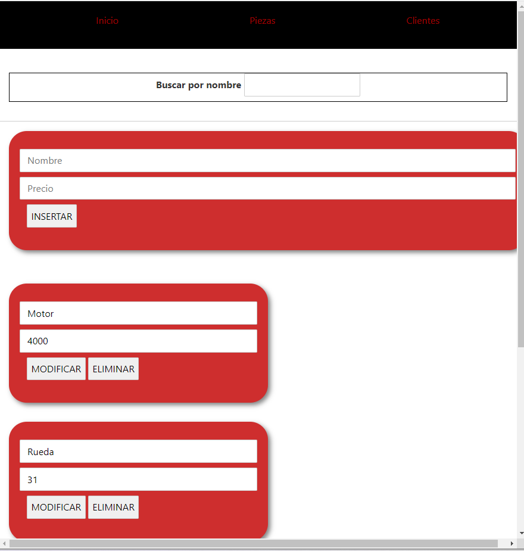
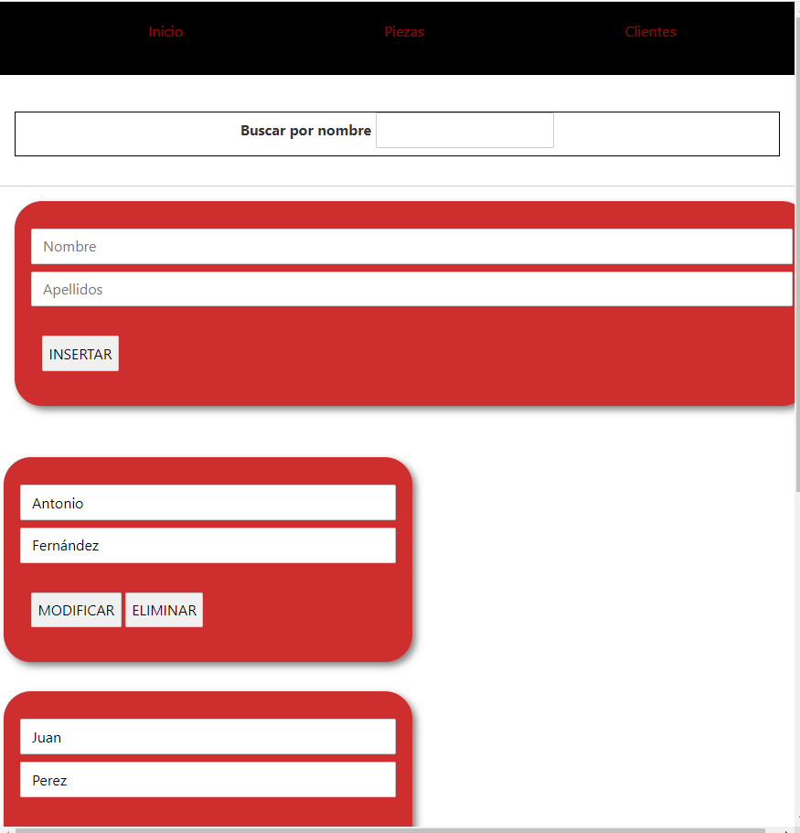
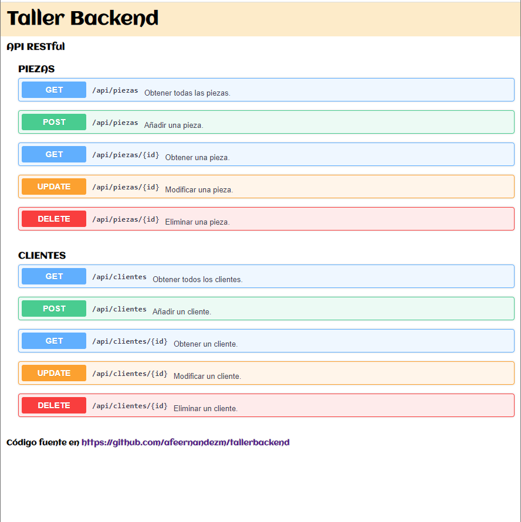

# FRONTEND (con Svelte)

>ENLACES A FRONTEND Y BACKEND DE NUESTRA APLICACIÓN
>
>Nuestra aplicación tiene por detrás una API REST de un taller la cual la podemos encontrar en **[tallerbackend](https://tallerbackend.onrender.com/)**
>El frontend de nuestra aplicación lo podemos encontrar en  **[tallerfrontend](https://tallerfrontend.vercel.app/)**

## ¿Qué es Svelte?

Svelte es un **compilador** aunque también puede tomarse como framework. Svelte realiza una compilación de nuestro código, convirtiendo sus componentes en código imperativo altamente eficiente. 

## Desarrollo por componentes

Svelte permite el desarrollo por componentes. 

Un componente es **una parte de una aplicación web que encapsula código HTML, CSS y JavaScript**, de forma que no puede ser afectado por el código de la página que lo incluye, salvo que usemos los mecanismos establecidos a tal efecto. Por tanto permiten la reutilización y encapsulación de código cliente.

## Ventajas de uso de Svelte

- Tenemos que escribir mucho menos código frente a otros frameworks.
- El código final se ejecuta de forma muy eficiente y rápida.
- El peso (cantidad de KB) de la aplicación final es muy pequeño.
- Facilita la programación reactiva.
- Sintaxis más simple

## Inicio de un proyecto de svelte

Para iniciar un proyecto de svelte, ejecutamos:

```console
npx  degit  sveltejs/template   nombre-proyecto
```

## TallerApp

Nuestra aplicación trata de un taller en el cual se pueden insertar piezas, borrar y modificar. A su vez, también se pueden hacer las mismas operaciones con los clientes

**Ejemplos visuales de nuestra aplicación**

## EJEMPLOS FRONTEND

**INICIO**


**PIEZAS**


**CLIENTES**


## EJEMPLOS BACKEND



## Resumen

En resumen, en esta tarea hemos realizado y aprendido lo siguinete: 

- Crear un repositorio en github
- Configurar una clave SSH 
- Uso de comandos más frecuentes de git
- Uso de markdown para la realización de **README.md**
